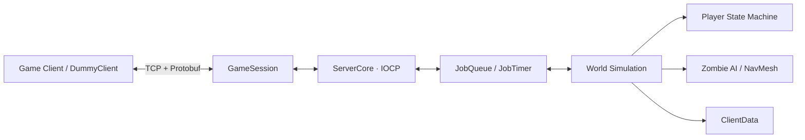

# CppServer

Windows IOCP를 기반으로 구현한 C++ 멀티플레이 게임 서버입니다. 비동기 네트워크 처리, 패킷 직렬화, 잡 시스템, 월드 시뮬레이션과 캐릭터 상태 머신을 하나의 서버 구조로 구성했으며, `DummyClient`로 접속과 기본 패킷 흐름을 확인할 수 있습니다.

## 주요 기능

- IOCP 기반 비동기 TCP 서버/클라이언트
- 세션 관리와 패킷 단위 송수신
- 메모리 풀, 오브젝트 풀, 송수신 버퍼 관리
- 멀티스레드 잡 큐, 글로벌 큐, 예약 작업 타이머
- Protobuf 기반 패킷 정의 및 핸들러 코드 생성
- 서버 권위의 플레이어 접속, 이동, 애니메이션, 체력 동기화
- 서버 권위의 몬스터 생성, 이동, 피격, 사망 및 제거 동기화
- 클라이언트는 인풋 전달과 뷰어의 역할
- 상태 머신 기반 플레이어·좀비 행동 처리
- NavMesh 경로 탐색과 애니메이션 데이터 로드

## 구조



| 구성 요소 | 역할 |
| --- | --- |
| `GameServer` | 게임 세션, 월드 업데이트, 플레이어와 몬스터 로직 |
| `ServerCore` | IOCP, 소켓, 세션, 잡 시스템 및 메모리 공통 모듈 |
| `DummyClient` | 로그인과 몬스터 생성 패킷을 보내는 테스트 클라이언트 |
| `Common/Protobuf` | `.proto` 원본과 패킷 코드 생성 배치 파일 |
| `Tools` | Python/Jinja2 기반 패킷 생성기 |
| `ClientData` | NavMesh 및 캐릭터 애니메이션 데이터 |

## 기술 스택

- C++
- Windows IOCP
- Google Protocol Buffers

## 실행 환경

- Windows 10 이상
- Visual Studio 2022의 **Desktop development with C++** 워크로드
- Windows 10 SDK
- x64 빌드 권장
- 패킷 코드를 다시 생성할 경우 Python 3와 `jinja2`

`GameServer`의 x64 구성은 별도 `GameCoding` 프로젝트의 `MathLibrary`와 `NavBuild` 헤더를 참조합니다. 다음과 같이 두 저장소가 같은 상위 디렉터리에 있어야 합니다.

```text
repos/
├─ Server/
└─ GameCoding/
   ├─ MathLibrary/
   └─ NavBuild/
```

링크에 필요한 라이브러리는 구성에 맞춰 아래 경로에 준비해야 합니다.

```text
Libraries/Libs/
├─ Protobuf/{Debug|Release}/
├─ MathLibrary/{Debug|Release}/
├─ NavBuild/{Debug|Release}/
└─ ServerCore/{Debug|Release}/   # ServerCore 빌드 시 생성
```

## 시작하기

1. 저장소와 필요한 `GameCoding` 프로젝트를 위 디렉터리 구조로 배치합니다.
2. Protobuf, MathLibrary, NavBuild 라이브러리를 `Libraries/Libs` 아래에 준비합니다.
3. Visual Studio에서 `Server.sln`을 엽니다.
4. `ServerCore`를 먼저 빌드한 뒤 `GameServer`와 `DummyClient`를 빌드합니다.
5. `GameServer`의 작업 디렉터리가 `GameServer` 폴더인지 확인하고 서버를 실행합니다.
6. `DummyClient`를 실행하고 Enter를 눌러 서버에 접속합니다.

기본 서버 주소는 `127.0.0.1:7777`이며 최대 100개 세션을 받습니다. 서버는 `ClientData`의 `.nav`, `.animData` 파일을 시작 시 로드하고 50ms 간격으로 월드를 갱신합니다.

## 패킷 코드 생성

패킷은 `Common/Protobuf/bin/Protocol.proto`에서 정의합니다. 생성 도구를 다시 만들거나 `GenPackets.exe`를 준비한 후 다음 배치 파일을 실행합니다.

```powershell
cd Common\Protobuf\bin
.\GenPackets.bat
```

이 작업은 Protobuf C++ 소스와 송수신 패킷 핸들러를 생성해 `GameServer`, `DummyClient` 및 연결된 게임 클라이언트 프로젝트로 복사합니다. 배치 파일을 실행하기 전에 대상 경로를 현재 개발 환경에 맞게 확인하세요.

## 주요 패킷

| 방향 | 패킷 | 설명 |
| --- | --- | --- |
| Client → Server | `C_LOGIN` | 플레이어 로그인 |
| Client → Server | `C_PLAYER_INPUT` | 카메라 방향과 입력 전송 |
| Client → Server | `C_CHAT` | 채팅 메시지 전송 |
| Server → Client | `S_LOGIN` | 로그인 결과와 월드 스냅샷 |
| Server → Client | `S_PLAYER_MOVE` | 플레이어 이동 동기화 |
| Server → Client | `S_MONSTER_MOVE` | 몬스터 이동 동기화 |
| Server → Client | `S_*_ANIMATION` | 애니메이션 상태 동기화 |
| Server → Client | `S_*_HP_CHANGE` | 체력 변경 동기화 |

## 참고

- 서버 주소와 포트는 `GameServer/GameServer.cpp`, `DummyClient/DummyClient.cpp`에서 변경할 수 있습니다.
- 생성된 Protobuf 파일과 패킷 핸들러는 원본 `.proto`와 함께 수정 상태를 관리해야 합니다.
